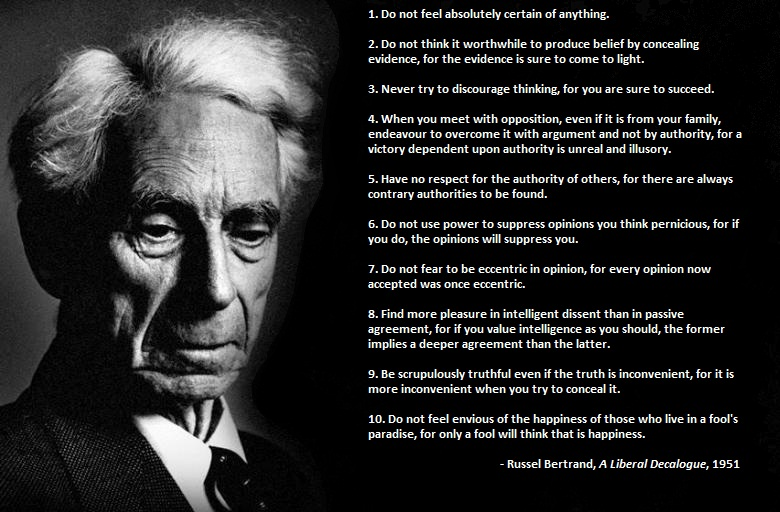

# History-of-the-First-Order-Logic-and-FOL-python-solver-implementation
Research on the origins of the logic of the first order, starting from the first thoughts of detachment from Aristotelian logic.

This work
