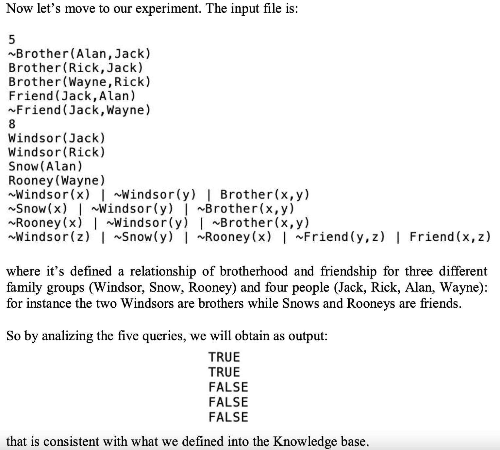

# History-of-the-First-Order-Logic
Research on the origins of the logic of the first order, starting from the first thoughts of detachment from Aristotelian logic.

In this work we will see also a lot of formulation examples (in comparison) applied to the different thought of the authors of the past (discussed in the main report), starting from the first theory models (mid-1800) to the most recent ones (early 1900).

To complete the work, a modern python solver impelemntation is realized.

